<div align="center">

# 🏋️‍♂️ Ejercicios


</div>

---

### Indice
- [Ejercicio 1](#ejercicio-1)
- [Ejercicio 2](#ejercicio-2)
- [Ejercicio 3](#ejercicio-3)
- [Ejercicio 4](#ejercicio-4)
- [Ejercicio 5](#ejercicio-5)
- [Ejercicio 6](#ejercicio-6)
- [Ejercicio 7](#ejercicio-7)
- [Ejercicio 8](#ejercicio-8)
- [Ejercicio 9](#ejercicio-9)
- [Ejercicio 10](#ejercicio-10)
- [Ejercicio 11](#ejercicio-11)

---

<div align="center">

  ## Ejercicio 1

  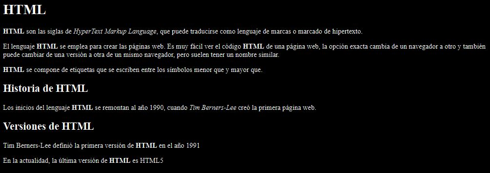
</div>

<details><summary>Codigo HTML</summary>

```html
<!DOCTYPE html>
<html>
<head>
  <title>El título de la página</title>
</head>
<body>
  <h1>HTML</h1>
  <p><strong>HTML</strong> son las siglas de <em>HyperText Markup Language</em>, que puede traducirse como lenguaje de marcas o marcado de hipertexto.</p>

  <p>El lenguaje <strong>HTML</strong> se emplea para crear las páginas web. Es muy fácil ver el código <strong>HTML</strong> de una página web, la opción exacta cambia de un navegador a otro y también puede cambiar de una versión a otra de un mismo navegador, pero suelen tener un nombre similar.</p>

  <p><strong>HTML</strong> se compone de etiquetas que se escriben entre los símbolos menor que y mayor que.</p>

  <h2>Historia de HTML</h2>

  <p>Los inicios del lenguaje <strong>HTML</strong> se remontan al año 1990, cuando <em>Tim Berners-Lee</em> creó la primera página web.</p>

  <h2>Versiones de HTML</h2>
  
  <p>Tim Berners-Lee definió la primera versión de <strong>HTML</strong> en el año 1991</p>

  <p>En la actualidad, la última versión de <strong> HTML</strong> es HTML5</p>

</body>
</html>
```

</details>

<div align="center">

  ## Ejercicio 2

  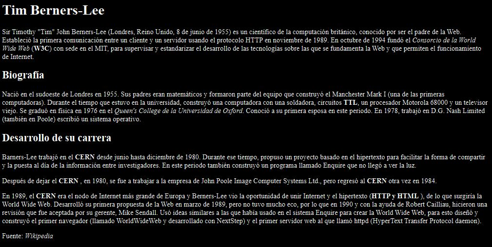
</div>


<details><summary>Codigo HTML</summary>

```html
<!DOCTYPE html>
<html lang="en">
<head>
  <meta charset="UTF-8">
  <meta http-equiv="X-UA-Compatible" content="IE=edge">
  <meta name="viewport" content="width=device-width, initial-scale=1.0">
  <title>Tim Berners-Lee.</title>
</head>
<body>
  <h1>Tim Berners-Lee</h1>
  
  <p>Sir Timothy "Tim" John Berners-Lee (Londres, Reino Unido, 8 de junio de 1955) es un científico de la computación británico, conocido por ser el padre de la Web. Estableció la primera comunicación entre un cliente y un servidor usando el protocolo HTTP en noviembre de 1989. En octubre de 1994 fundó el <em>Consorcio de la World Wide Web</em> (<strong>W3C</strong>) con sede en el MIT, para supervisar y estandarizar el desarrollo de las tecnologías sobre las que se fundamenta la Web y que permiten el funcionamiento de Internet.</p>

  <h2>Biografía</h2> 

  <p> Nació en el sudoeste de Londres en 1955. Sus padres eran matemáticos y formaron parte del equipo que construyó el Manchester Mark I (una de las primeras computadoras). Durante el tiempo que estuvo en la universidad, construyó una computadora con una soldadora, circuitos <strong>TTL</strong>, un procesador Motorola 68000 y un televisor viejo. Se graduó en física en 1976 en el <em>Queen's College de la Universidad de Oxford</em>. Conoció a su primera esposa en este periodo. En 1978, trabajó en D.G. Nash Limited (también en Poole) escribió un sistema operativo.</p>

  <h2>Desarrollo de su carrera</h2>
  
  <p>Barners-Lee trabajó en el <strong> CERN</strong> desde junio hasta diciembre de 1980. Durante ese tiempo, propuso un proyecto basado en el hipertexto para facilitar la forma de compartir y la puesta al día de la información entre investigadores. En este periodo también construyó un programa llamado Enquire que no llegó a ver la luz.</p>

  <p> Después de dejar el <strong>CERN</strong> , en 1980, se fue a trabajar a la empresa de John Poole Image Computer Systems Ltd., pero regresó al <strong>CERN</strong> otra vez en 1984.</p>

  <p>En 1989, el <strong>CERN</strong> era el nodo de Internet más grande de Europa y Berners-Lee vio la oportunidad de unir Internet y el hipertexto (<strong>HTTP y HTML</strong> ), de lo que surgiría la World Wide Web. Desarrolló su primera propuesta de la Web en marzo de 1989, pero no tuvo mucho eco, por lo que en 1990 y con la ayuda de Robert Cailliau, hicieron una revisión que fue aceptada por su gerente, Mike Sendall. Usó ideas similares a las que había usado en el sistema Enquire para crear la World Wide Web, para esto diseñó y construyó el primer navegador (llamado WorldWideWeb y desarrollado con NextStep) y el primer servidor web al que llamó httpd (HyperText Transfer Protocol daemon).</p>

  <p>Fuente: <em>Wikipedia</em> </p>
</body>
</html>
```

</details>

<div align="center">

  ## Ejercicio 3

  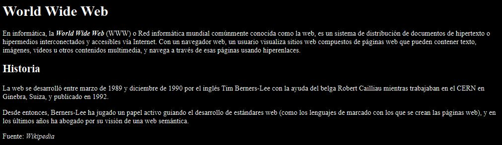
</div>

<details><summary>Codigo HTML</summary>

```html
<!DOCTYPE html>
<html lang=es>
<head>
    <title>World Wide Web</title>
</head>
<body>
  <h1>World Wide Web</h1>

  <p>En informática, la <strong><em>World Wide Web</em></strong> (WWW) o Red informática mundial comúnmente conocida como la web, es un sistema de distribución de documentos de hipertexto o hipermedios interconectados y accesibles vía Internet. Con un navegador web, un usuario visualiza sitios web compuestos de páginas web que pueden contener texto, imágenes, vídeos u otros contenidos multimedia, y navega a través de esas páginas usando hiperenlaces.<p>

  <h2>Historia</h2>

  <p>La web se desarrolló entre marzo de 1989 y diciembre de 1990 por el inglés Tim Berners-Lee con la ayuda del belga Robert Cailliau mientras trabajaban en el CERN en Ginebra, Suiza, y publicado en 1992.</p>

  <p>Desde entonces, Berners-Lee ha jugado un papel activo guiando el desarrollo de estándares web (como los lenguajes de marcado con los que se crean las páginas web), y en los últimos años ha abogado por su visión de una web semántica.</p>

  <p>Fuente: <em>Wikipedia</em></p>
</body>
</html>
```

</details>


<div align="center">

  ## Ejercicio 4

  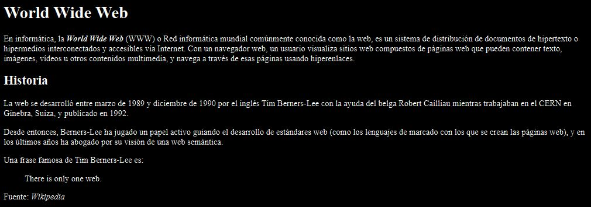
</div>

<details><summary>Codigo HTML</summary>

```html
<!DOCTYPE html>
<html lang="es">
<head>
  <title>World Wide Web</title>
  <meta charset="UTF-8">
</head>
<body>
  <h1>World Wide Web</h1>

  <p>En informática, la <strong><em>World Wide Web</em></strong> (WWW) o Red informática mundial comúnmente conocida como la web, es un sistema de distribución de documentos de hipertexto o hipermedios interconectados y accesibles vía Internet. Con un navegador web, un usuario visualiza sitios web compuestos de páginas web que pueden contener texto, imágenes, vídeos u otros contenidos multimedia, y navega a través de esas páginas usando hiperenlaces.</p>

  <h2>Historia</h2>

  <p>La web se desarrolló entre marzo de 1989 y diciembre de 1990 por el inglés Tim Berners-Lee con la ayuda del belga Robert Cailliau mientras trabajaban en el CERN en Ginebra, Suiza, y publicado en 1992.</p>

  <p>Desde entonces, Berners-Lee ha jugado un papel activo guiando el desarrollo de estándares web (como los lenguajes de marcado con los que se crean las páginas web), y en los últimos años ha abogado por su visión de una web semántica.</p>

  <p>Una frase famosa de Tim Berners-Lee es:</p>

  <blockquote>
    <p lang="en">There is only one web.</p>
  </blockquote>

  <p>Fuente: <em>Wikipedia</em></p>
</body>
</html>
```

</details>


<div align="center">

  ## Ejercicio 5

  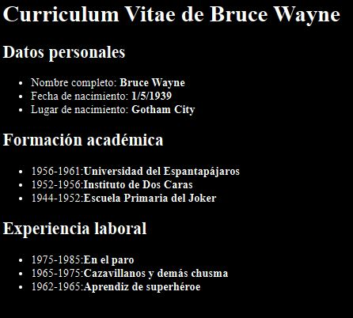
</div>


<details><summary>Codigo HTML</summary>

```html
<!DOCTYPE html>
<html lang="es">
<head>
  <meta charset="UTF-8">
  <meta http-equiv="X-UA-Compatible" content="IE=edge">
  <meta name="viewport" content="width=device-width, initial-scale=1.0">
  <title>Curriculum Vitae de Bruce Wayne</title>
</head>
<body>

  <h1>Curriculum Vitae de Bruce Wayne</h1>

  <h2>Datos personales</h2>
  <ul>
    <li>Nombre completo: <strong>Bruce Wayne</strong> </li>
    <li>Fecha de nacimiento: <strong>1/5/1939</strong></li>
    <li>Lugar de nacimiento: <strong>Gotham City</strong> </li>
  </ul>

  <h2>Formación académica</h2>
  <ul>
    <li>1956-1961:<strong>Universidad del Espantapájaros</strong></li>
    <li>1952-1956:<strong>Instituto de Dos Caras</strong></li>
    <li>1944-1952:<strong>Escuela Primaria del Joker</strong></li>
  </ul> 

  <h2>Experiencia laboral</h2>
  <ul>
    <li>1975-1985:<strong>En el paro</strong></li>
    <li>1965-1975:<strong>Cazavillanos y demás chusma</strong></li>
    <li>1962-1965:<strong>Aprendiz de superhéroe</strong></li>
  </ul>
</body>
</html>
```

</details>


<div align="center">

  ## Ejercicio 6

  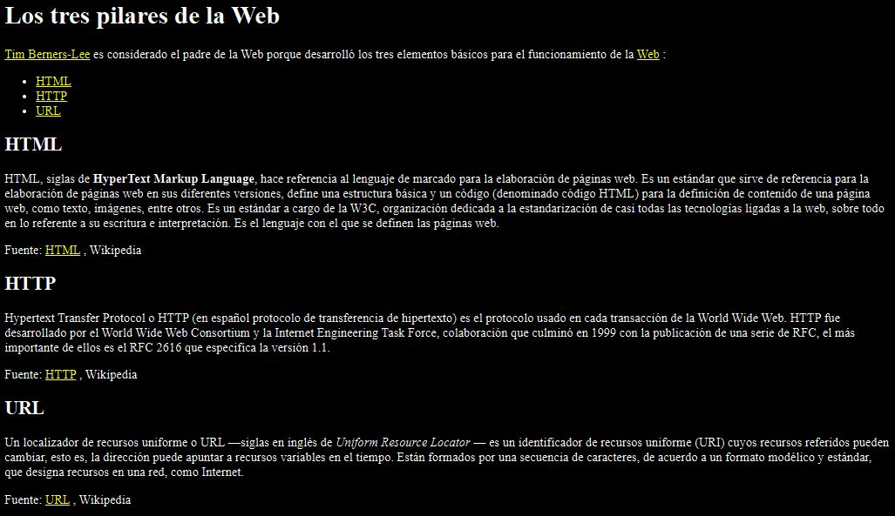
</div>


<details><summary>Codigo HTML</summary>

```html
<!DOCTYPE html>
<html lang="en">
<head>
  <meta charset="UTF-8">
  <meta http-equiv="X-UA-Compatible" content="IE=edge">
  <meta name="viewport" content="width=device-width, initial-scale=1.0">
  <title>Los tres pilares de la Web</title>
</head>
<body>
  <h1>Los tres pilares de la Web</h1>
  <p><a href="http://es.wikipedia.org/wiki/Tim_Berners-Lee">Tim Berners-Lee</a> es considerado el padre de la Web porque desarrolló los tres elementos básicos para el funcionamiento de la <a href="http://es.wikipedia.org/wiki/World_Wide_Web">Web</a> :</p>
  <ul>
    <li><a href="#HTML">HTML</a></li>
    <li><a href="#HTTP">HTTP</a></li>
    <li><a href="#URL">URL</a></li>
  </ul>
  
  <h2 id="HTML">HTML</h2>
  <p>HTML, siglas de <strong>HyperText Markup Language</strong>, hace referencia al lenguaje de marcado para la elaboración de páginas web. Es un estándar que sirve de referencia para la elaboración de páginas web en sus diferentes versiones, define una estructura básica y un código (denominado código HTML) para la definición de contenido de una página web, como texto, imágenes, entre otros. Es un estándar a cargo de la W3C, organización dedicada a la estandarización de casi todas las tecnologías ligadas a la web, sobre todo en lo referente a su escritura e interpretación. Es el lenguaje con el que se definen las páginas web.</p>
  
  <p> Fuente: <a href="http://es.wikipedia.org/wiki/HTML">HTML</a> , Wikipedia</p>
  
  <h2 id="HTTP">HTTP</h2> 
  
  <p>Hypertext Transfer Protocol o HTTP (en español protocolo de transferencia de hipertexto) es el protocolo usado en cada transacción de la World Wide Web. HTTP fue desarrollado por el World Wide Web Consortium y la Internet Engineering Task Force, colaboración que culminó en 1999 con la publicación de una serie de RFC, el más importante de ellos es el RFC 2616 que especifica la versión 1.1.</p>
  
  <p> Fuente: <a href="http://es.wikipedia.org/wiki/Hypertext_Transfer_Protocol">HTTP</a> , Wikipedia</p>
  
  <h2 id="URL">URL</h2>
  
  <p>Un localizador de recursos uniforme o URL —siglas en inglés de <em>Uniform Resource Locator</em> — es un identificador de recursos uniforme (URI) cuyos recursos referidos pueden cambiar, esto es, la dirección puede apuntar a recursos variables en el tiempo. Están formados por una secuencia de caracteres, de acuerdo a un formato modélico y estándar, que designa recursos en una red, como Internet.</p> 
  
  <p>Fuente: <a href="http://es.wikipedia.org/wiki/Localizador_de_recursos_uniforme">URL</a> , Wikipedia</p> 
</body>
</html>
```

</details>

<div align="center">

  ## Ejercicio 7

  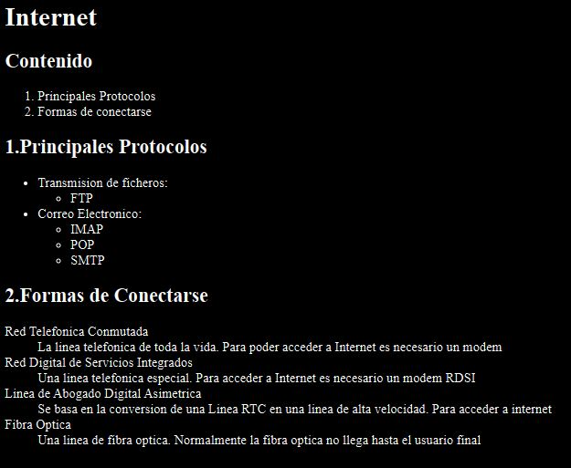
</div>


<details><summary>Codigo HTML</summary>

```html
<!DOCTYPE html>
<html lang="en">
<head>
    <meta charset="UTF-8">
    <meta http-equiv="X-UA-Compatible" content="IE=edge">
    <meta name="viewport" content="width=device-width, initial-scale=1.0">
    <title>Document</title>
</head>
<body>
  <h1>Internet</h1>

  <h2>Contenido</h2>
  <ol>
    <li>Principales Protocolos</li>
    <li>Formas de conectarse</li>
  </ol>

  <h2>1.Principales Protocolos</h2>
  <ul>
    <li>Transmision de ficheros:</li>
    <ul><li>FTP</li></ul>
    <li>Correo Electronico:</li>
    <ul>
      <li>IMAP</li>
      <li>POP</li>
      <li>SMTP</li>
    </ul>
  </ul>
  
  <h2>2.Formas de Conectarse</h2>
  <dl>
    <dt>Red Telefonica Conmutada</dt>
    <dd>La linea telefonica de toda la vida. Para poder acceder a Internet es necesario un modem</dd>

    <dt>Red Digital de Servicios Integrados</dt>
    <dd>Una linea telefonica especial. Para acceder a Internet es necesario un modem RDSI</dd>

    <dt>Linea de Abogado Digital Asimetrica</dt>
    <dd>Se basa en la conversion de una Linea RTC en una linea de alta velocidad. Para acceder a internet</dd>

    <dt>Fibra Optica</dt>
    <dd>Una linea de fibra optica. Normalmente la fibra optica no llega hasta el usuario final</dd>
  </dl>
</body>
</html>
```

</details>

<div align="center">

  ## Ejercicio 8

  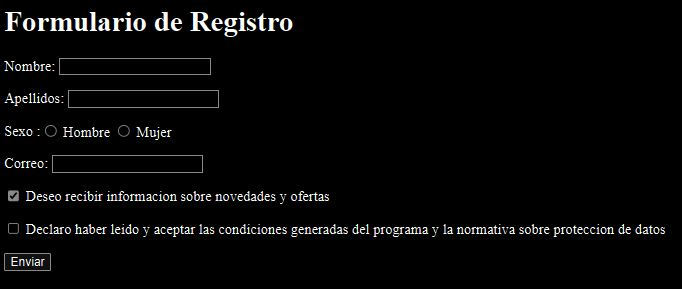
</div>


<details><summary>Codigo HTML</summary>

```html
<!DOCTYPE html>
<html lang="en">
<head>
  <meta charset="UTF-8">
  <meta http-equiv="X-UA-Compatible" content="IE=edge">
  <meta name="viewport" content="width=device-width, initial-scale=1.0">
  <title>Formulario de registro - Mi web</title>
</head>
<body>
  <h1>Formulario de Registro</h1>
  <form action="" method="get">
    <p>Nombre: <input type="text" maxlength="50" name="nombre"> </p>
    <p>Apellidos: <input type="text" maxlength="50" name="apellidos"></p>

    <p>Sexo :<label for="hombre"><input type="radio" value="Hombre" name="hombre-mujer" id="hombre"> Hombre </label>
    <label for="mujer"><input type="radio" value="Mujer" name="hombre-mujer" id="mujer"> Mujer</label></p>

    <p>Correo: <input type="email" maxlength="50" name="correo"></p>
    <p><input type="checkbox" name="info" checked="checked"> Deseo recibir informacion sobre novedades y ofertas</p>
    <p><input type="checkbox" name="condiciones"> Declaro haber leido y aceptar las condiciones generadas del programa y la normativa sobre proteccion de datos</p>
    <p><input type="submit" value="Enviar"></p>
  </form>
</body>
</html>
```

</details>

<div align="center">

  ## Ejercicio 9

  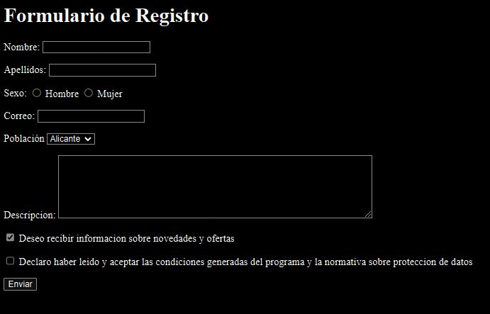
</div>


<details><summary>Codigo HTML</summary>

```html
<!DOCTYPE html>
<html lang="en">
<head>
  <meta charset="UTF-8">
  <meta http-equiv="X-UA-Compatible" content="IE=edge">
  <meta name="viewport" content="width=device-width, initial-scale=1.0">
  <title>Formulario de registro - Mi web</title>
</head>
<body>
  <h1>Formulario de Registro</h1>
  <form action="" method="get">
    <p>
      <label for="nombre">Nombre:</label>  
      <input type="text" maxlength="50" name="nombre" id="nombre"> 
    </p>

    <p>
      <label for="apellidos">Apellidos:</label> 
      <input type="text" maxlength="50" name="apellidos" id="apellidos">
    </p>

    <p>Sexo:
      <label for="hombre"><input type="radio" value="Hombre" name="hombre-mujer" id="hombre"> Hombre </label>
      <label for="mujer"><input type="radio" value="Mujer" name="hombre-mujer" id="mujer"> Mujer</label>
    </p>

    <p><label for="correo">Correo:</label> <input type="email" maxlength="50" name="correo" id="correo"></p>

    <p>
      <label for="poblacion">Población</label>  
      <select name="poblacion" id="poblacion"> 
        <option>Alicante</option>
        <option>Madrid</option>
        <option>Sevilla</option>
        <option>Valencia</option>
      </select>
    </p>

    <p>
      <label for="descripcion">Descripcion:</label>  
      <textarea name="descripcion" id="descripcion" cols="60" rows="6"></textarea>
    </p>

    <p>
      <input type="checkbox" name="info" checked="checked" id="info">
      <label for="info">Deseo recibir informacion sobre novedades y ofertas</label> 
    </p>

    <p>
      <input type="checkbox" name="condiciones" id="condiciones">
      <label for="condiciones">Declaro haber leido y aceptar las condiciones generadas del programa y la normativa sobre proteccion de datos</label> 
    </p>

    <p><input type="submit"  value="Enviar"></p>
  </form>
</body>
</html>
```

</details>

<div align="center">

  ## Ejercicio 10

  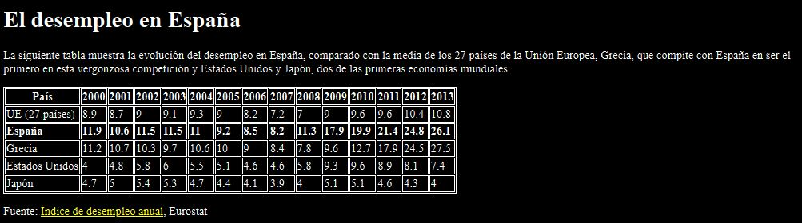
</div>

<details><summary>Codigo HTML</summary>

```html
<!DOCTYPE html>
<html>
<head>
  <title>Desempleo</title>
  <style>
    table, tr, th, td {
      border: 1px solid black;
    }
  </style>
</head>
<body>

  <h1>El desempleo en España</h1>

  <p>
    La siguiente tabla muestra la evolución del desempleo en España, comparado con la media de los 27 países de la Unión Europea, Grecia, que compite con España en ser el primero en esta vergonzosa competición y Estados Unidos y Japón, dos de las primeras economías mundiales.
  </p>

  <table>
    <tr>
      <th>País</th>
      <th>2000</th>
      <th>2001</th>
      <th>2002</th>
      <th>2003</th>
      <th>2004</th>
      <th>2005</th>
      <th>2006</th>
      <th>2007</th>
      <th>2008</th>
      <th>2009</th>
      <th>2010</th>
      <th>2011</th>
      <th>2012</th>
      <th>2013</th>
    </tr>

    <tr>
      <td>UE (27 países)</td>
      <td>8.9</td>
      <td>8.7</td>
      <td>9</td>
      <td>9.1</td>
      <td>9.3</td>
      <td>9</td>
      <td>8.2</td>
      <td>7.2</td>
      <td>7</td>
      <td>9</td>
      <td>9.6</td>
      <td>9.6</td>
      <td>10.4</td>
      <td>10.8</td>
    </tr>

    <tr>
      <td><strong>España</strong></td>
      <td><strong>11.9</strong></td>
      <td><strong>10.6</strong></td>
      <td><strong>11.5</strong></td>
      <td><strong>11.5</strong></td>
      <td><strong>11</strong></td>
      <td><strong>9.2</strong></td>
      <td><strong>8.5</strong></td>
      <td><strong>8.2</strong></td>
      <td><strong>11.3</strong></td>
      <td><strong>17.9</strong></td>
      <td><strong>19.9</strong></td>
      <td><strong>21.4</strong></td>
      <td><strong>24.8</strong></td>
      <td><strong>26.1</strong></td>
    </tr>

    <tr>
      <td>Grecia</td>
      <td>11.2</td>
      <td>10.7</td>
      <td>10.3</td>
      <td>9.7</td>
      <td>10.6</td>
      <td>10</td>
      <td>9</td>
      <td>8.4</td>
      <td>7.8</td>
      <td>9.6</td>
      <td>12.7</td>
      <td>17.9</td>
      <td>24.5</td>
      <td>27.5</td>
    </tr>

    <tr>
      <td>Estados Unidos</td>
      <td>4</td>
      <td>4.8</td>
      <td>5.8</td>
      <td>6</td>
      <td>5.5</td>
      <td>5.1</td>
      <td>4.6</td>
      <td>4.6</td>
      <td>5.8</td>
      <td>9.3</td>
      <td>9.6</td>
      <td>8.9</td>
      <td>8.1</td>
      <td>7.4</td>
    </tr>

    <tr>
      <td>Japón</td>
      <td>4.7</td>
      <td>5</td>
      <td>5.4</td>
      <td>5.3</td>
      <td>4.7</td>
      <td>4.4</td>
      <td>4.1</td>
      <td>3.9</td>
      <td>4</td>
      <td>5.1</td>
      <td>5.1</td>
      <td>4.6</td>
      <td>4.3</td>
      <td>4</td>
    </tr>

  </table>

  <p>
    Fuente: <a href="http://epp.eurostat.ec.europa.eu/tgm/table.do?tab=table&init=1&language=en&pcode=tsdec450&plugin=1">Índice de desempleo anual</a>, Eurostat
  </p>

</body>
</html>
```

</details>

<div align="center">

  ## Ejercicio 11

  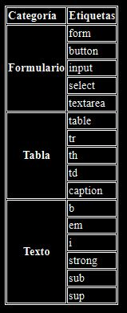
</div>

<details><summary>Codigo HTML</summary>

<!DOCTYPE html>
<html>
<head>
  <title>Tabla compleja</title>
  <style>
    table, tr, th, td {
      border: 1px solid black;
    }
  </style>
</head>
  <body>
    <table>
      <tr>
        <td><strong>Categoría</strong></td>
        <td><strong>Etiquetas</strong></td>
      </tr>

      <tr>
        <th rowspan="5"><strong>Formulario</strong></th>
        <td>form</td>
        <tr><td>button</td></tr>
        <tr><td>input</td></tr>
        <tr><td>select</td></tr>
        <tr><td>textarea</td></tr>
      </tr>
      <tr>
        <th rowspan="5"><strong>Tabla</strong></th>
        <td>table</td>
        <tr><td>tr</td></tr>
        <tr><td>th</td></tr>
        <tr><td>td</td></tr>
        <tr><td>caption</td></tr>
      </tr>
  
      <tr>
        <th rowspan="6"><strong>Texto</strong></th>
        <td>b</td>
        <tr><td>em</td></tr>
        <tr><td>i</td></tr>
        <tr><td>strong</td></tr>
        <tr><td>sub</td></tr>
        <tr><td>sup</td></tr>
      </tr>
  </table>
</body>
</html>

</details>


<div align="center">

  ## Ejercicio 12

  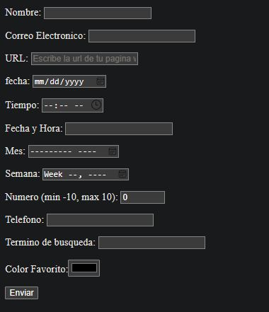
</div>

<details><summary>Codigo HTML</summary>

## Ejercicio 12

```html
<!DOCTYPE html>
<html lang="en">
<head>
  <meta charset="UTF-8">
  <meta http-equiv="X-UA-Compatible" content="IE=edge">
  <meta name="viewport" content="width=device-width, initial-scale=1.0">
  <title>Document</title>
</head>
<body>
  <form action="" method="get">
      <p><label for="nombre">Nombre:</label>
        <input type="text" name="nombre" id="nombre" required></p>

      <p><label for="correo">Correo Electronico:</label>
        <input type="email" name="correo" id="correo" required></p>

      <p><label for="url">URL:</label>
        <input type="url" id="url" name="url" placeholder="Escribe la url de tu pagina web"></p>

      <p><label for="fecha">fecha:</label>
        <input type="date" id="fecha" name="fecha"></p>

      <p><label for="tiempo">Tiempo:</label>
        <input type="time" id="tiempo" name="tiepo"></p>

      <p><label for="fechayhora">Fecha y Hora:</label>
        <input type="datetime" id="fechayhora" name="fechayhora"></p>

      <p><label for="mes">Mes:</label>
        <input type="month" id="mes" name="fecha"></p>

      <p><label for="semana">Semana:</label>
        <input type="week" id="semana" name="semana"></p>

      <p><label for="numero">Numero (min -10, max 10):</label>
        <input type="number" min="-10" max="10" value="0" name="numero" id="numero"></p>

      <p><label for="telefono">Telefono:</label>
        <input type="tel" id="telefono" name="telefono"></p>

      <p><label for="termino">Termino de busqueda:</label>
        <input type="search" id="termino" name="termino"></p>

      <p><label for="color">Color Favorito:</label><input type="color" name="color" id="color"></p>

      <p><input type="submit" value="Enviar"></p>

  </form>
</body>
</html>
```

<details>