# Haciendo Preguntas de Despegar

Crear una funcion que reciba los numeros y devuelva el resultado

Aumenta la ceosividad

String

De una constante

Da un error en tiempo de ejectución

Sensilles claridad, uso de normas, simbolos y flexibilidad
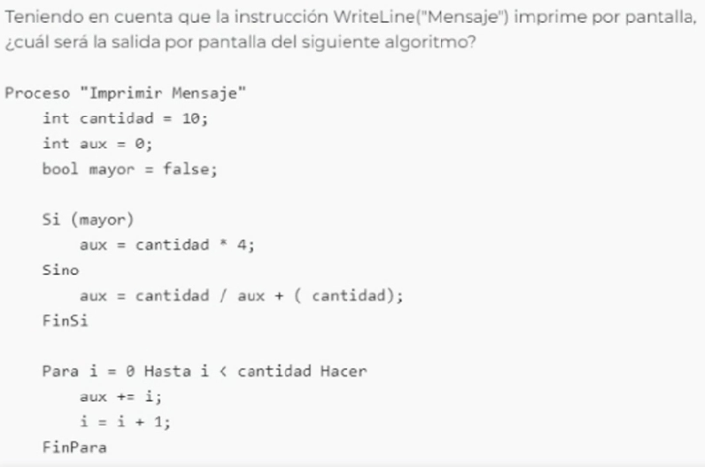
Da error al ejecutarse
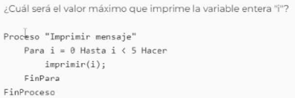
4
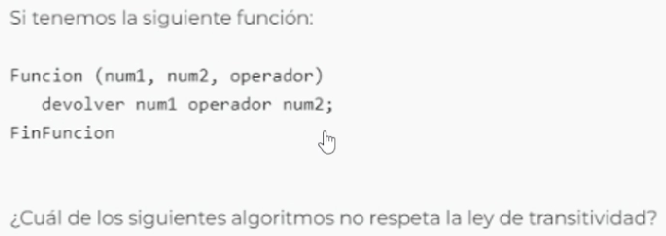
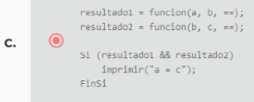
Las funciones retornan true o false
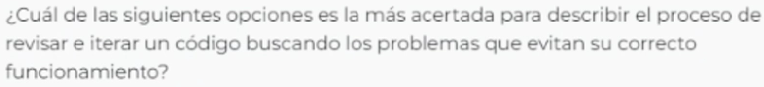
Proceso de depuración

Una estructura de manejo de errores

array [3] es igual a 9
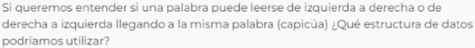
Una pila y una cola
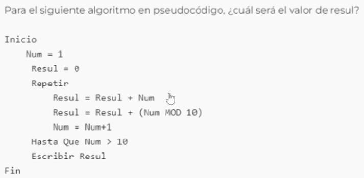
100

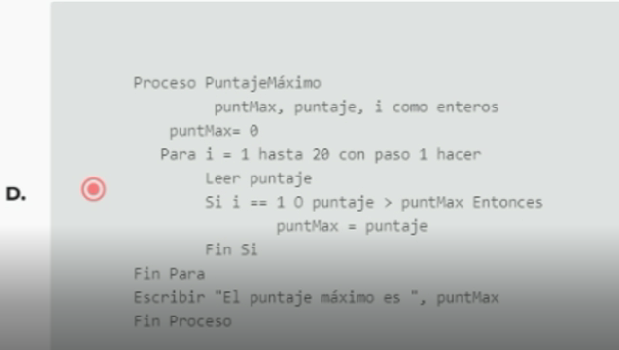

Archivo inexistente

Mejorar la velocidad de busqueda
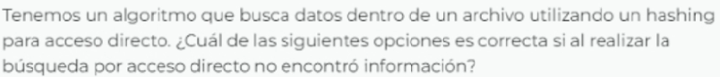
Busqueda secuencial
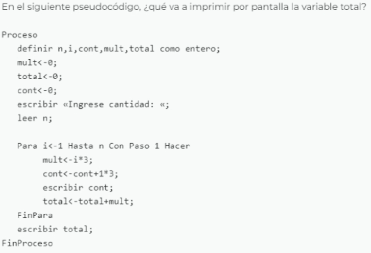
El total de la suma de la cantidad de los multiplos de 3
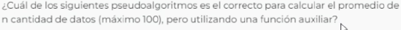
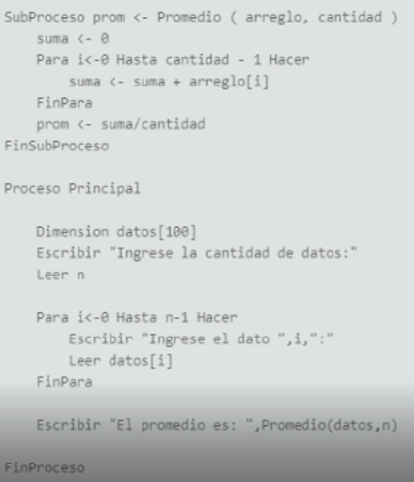

## Preguntas Java

Encapsulamiento, Herencia y Polimorfismo

Clase

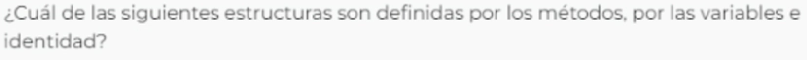
Objetos